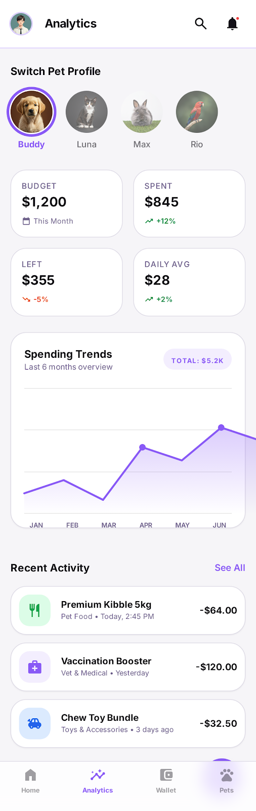
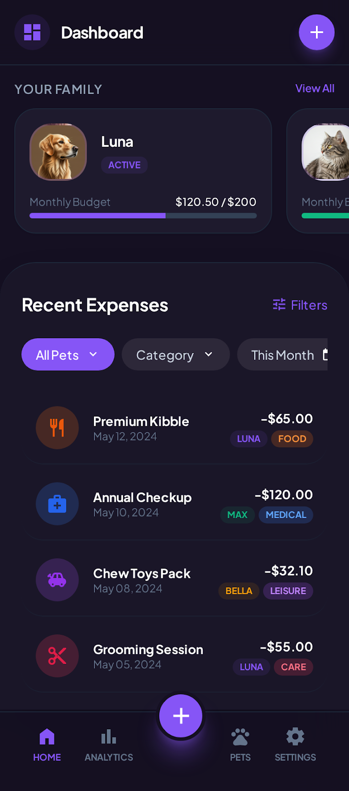
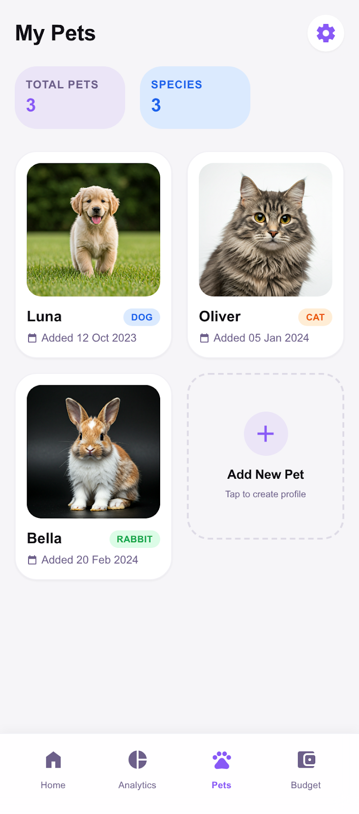

# Pet Budget Buddy

[](https://tailtally.vercel.app/)

A comprehensive application to help you track and manage your pet's expenses, ensuring you stay within budget while giving them the best care.

## 🌟 Capabilities & Use Cases

### 🎯 Core Use Cases
- **Budget Control**: Set strict monthly limits for categories like Food, Healthcare, and Toys to prevent overspending.
- **Multi-Pet Management**: distinct profiles for every pet. Track expenses separately for your Dog, Cat, or Hamster to see who costs the most!
- **Expense Logging**: Quickly log daily expenses on-the-go with a mobile-friendly interface.
- **Visual Analytics**: Understand your spending habits with intuitive charts that break down costs by category and time.

### ✨ Key Features
- **Smart Dashboard**: Real-time overview of your remaining budget and recent transactions.
- **Category Management**: Customizable categories with visual indicators for "Safe", "Warning", and "Over Budget" statuses.
- **Responsive Design**: Works perfectly on both your desktop and mobile device.
- **Secure Data**: Your data is persistent and safely stored.

---

## 📸 Gallery

<table width="100%">
  <tr>
    <td width="50%" align="center">
      <h3>Web Dashboard</h3>
      
    </td>
    <td width="50%" align="center">
      <h3>Web Analytics</h3>
      
    </td>
  </tr>
  <tr>
    <td align="center">
      <h3>Budget Management</h3>
      
    </td>
    <td align="center">
      <h3>Split Screen View</h3>
      
    </td>
  </tr>
  <tr>
    <td align="center">
      <h3>Mobile Dashboard</h3>
      
    </td>
    <td align="center">
      <h3>Log Expense</h3>
      
    </td>
  </tr>
    <tr>
    <td align="center" colspan="2">
      <h3>Pet Profiles</h3>
      
    </td>
  </tr>
</table>

---

## 💻 Tech Stack & Setup

This project is built with a modern stack for performance and developer experience:
- **Vite** (Build tool)
- **TypeScript** (Type safety)
- **React** (UI Library)
- **shadcn-ui** (Component System)
- **Tailwind CSS** (Styling)

### Quick Start

1. **Clone the repository**
   ```bash
   git clone <YOUR_GIT_URL>
   cd pet-budget-buddy
   ```

2. **Install dependencies**
   ```bash
   npm i
   ```

3. **Run locally**
   ```bash
   npm run dev
   ```

### Deployment

You can view the live application here: [https://tailtally.vercel.app/](https://tailtally.vercel.app/)


